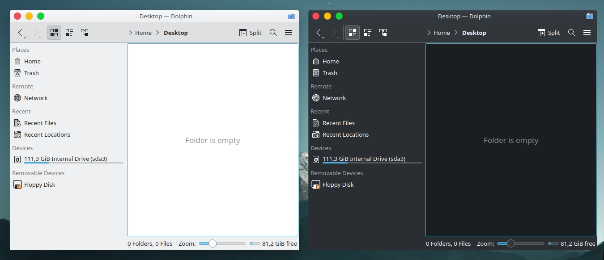

# BreezemitePlus
Aurorae theme for KDE Plasma that mimics Yosemite window decoration, but with Breeze colors to match Breeze window theme.

Forked from [andreyorst](https://github.com/andreyorst/Breezemite) to fix the button width/height and padding (no longer mantaining Breezemite).

### Installation:
Download the Zip in the "Code" button or type
>`git clone https://github.com/abiES76/BreezemitePlus/`

Copy theme folders to `~/.local/share/aurorae/themes`

or use my simple script `chmod +x && ./install.sh`

## OLD F.A.Q. 
#### Most of these should be fixed by the Aurorae Theme Engine

**Q.** My borders are oversized!  
**A.** Check if you're using **display scaling**, or especially **font scaling**. This theme is sensitive to them (my fault)

**Q.** Titlebar is transparent!  
**A.** Youre usind **HiDPI** display, right? check [this issue](https://github.com/andreyorst/Breezemite/issues/4#issuecomment-295890785) for solution. If not, open new issue and I'll try to help you

**Q.** No shade/roll up button!  
**A.** Yes. No shade button. It is bugged in aurorae theme engine.

**Q.** Icon for title bar Application Menu button is missing!  
**A.** Check [this](https://github.com/andreyorst/Breezemite/issues/5) issue for explanations.

**Q.** Incorrect Application Menu position!  
**A.** I personally recommend you to use this theme with application menu widget, since it is a mac style theme. But check [this](https://github.com/andreyorst/Breezemite/issues/6) issue for explanations.

If you re interested in theme visually similar to Breezemite/Plus take a look on the theme from [Igor Shovkun](https://github.com/ishovkun). It has all features which are missing in breezemite. [SierraBreeze](https://github.com/ishovkun/SierraBreeze).
